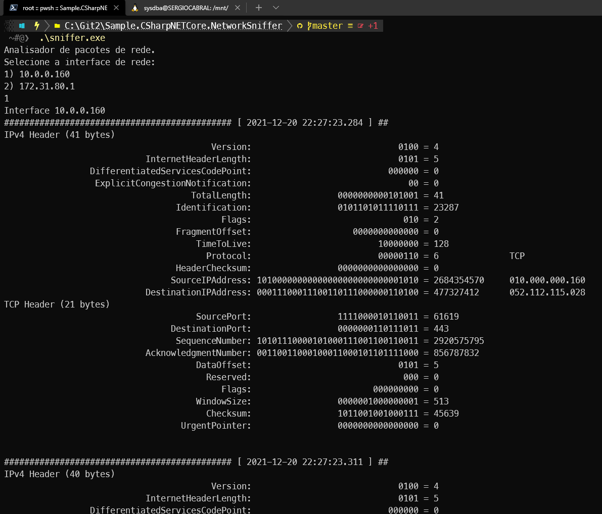

# Farejador (Sniffer) de Rede em C# para Windows

Um farejador (em inglês, sniffer) de rede é um **programa que captura os pacotes que trafegam pela rede** não importando para quem eles tenha sido endereçados. É como ler a correspondência de outra pessoa. Dito isto, fica claro que não é ético usar um programa desse tipo sem autorização do resposável pela rede em questão.

**O código-fonte que temos aqui é didático e gera um aplicativo que funciona por linha de comando, sem interface gráfica.**



*Figura 1: Saída do programa gerado por este código-fonte*

Para ver em funcionamento um aplicativo completo desse tipo, um famoso sniffer no mercado é o [Wireshark](https://www.wireshark.org/).


*Figura 2: Wireshark*

## Ambiente de Execução

O código-fonte, embora possa ser compilado para ambientes Unix, gera um programa que **só funciona no Windows**.

Foi escrito de modo a ser compatível com o `.NET 4.0` e `C# 5`. Desta forma qualquer computador com Windows pode compilar o código-fonte sem precisar instalar ferramentas de desenvolvimento.

Execute a linha de comando abaixo:

```
C:\Windows\Microsoft.NET\Framework\v4.0.30319\csc.exe sniffer.cs
```

Depois execute o programa recém gerado:

```
sniffer.exe
```

## Expert

| [](https://github.com/sergiocabral) |
| :-: |
|[sergiocabral.com](https://sergiocabral.com)|
